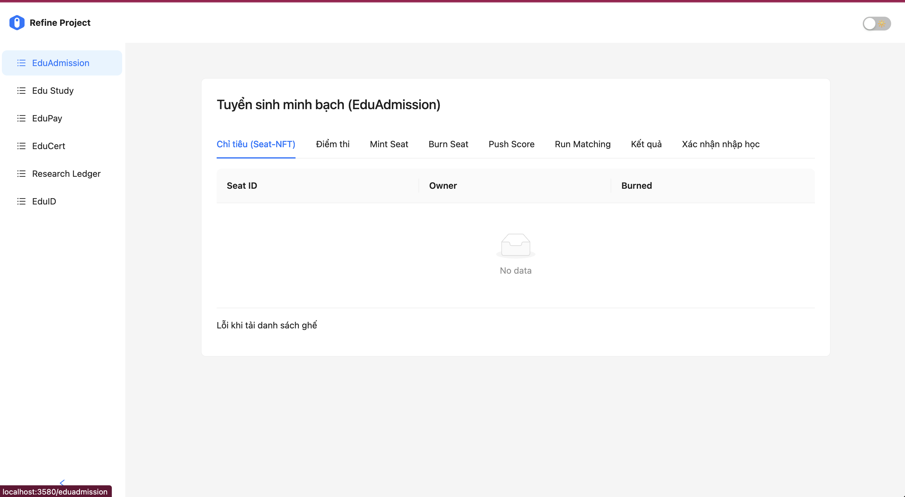
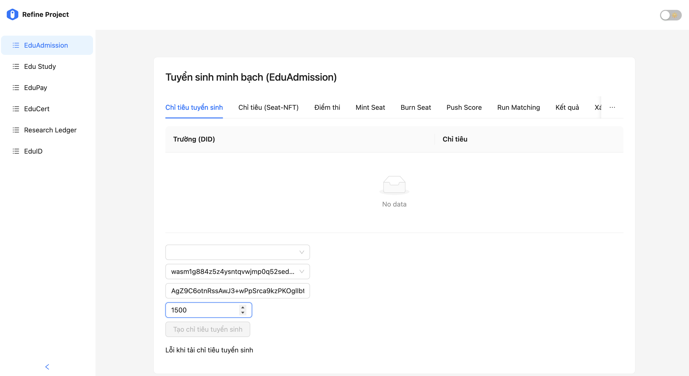
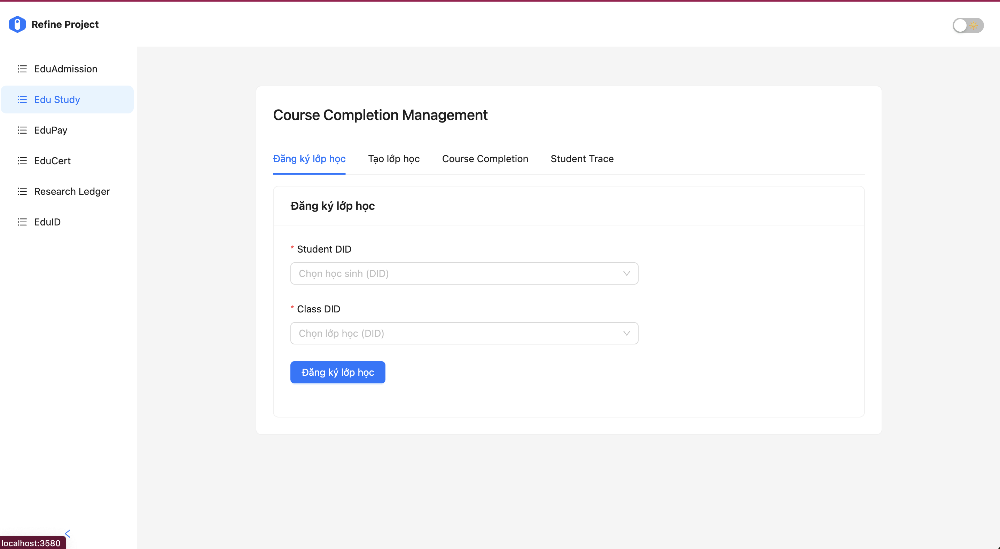
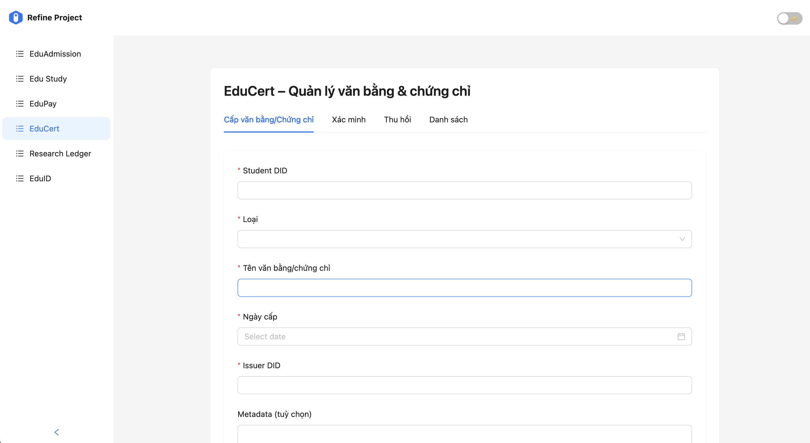
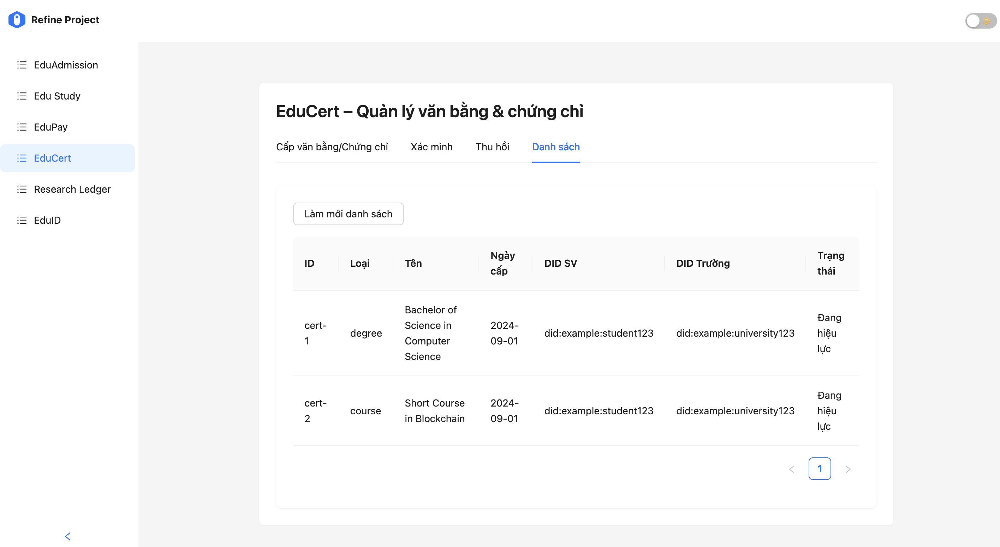
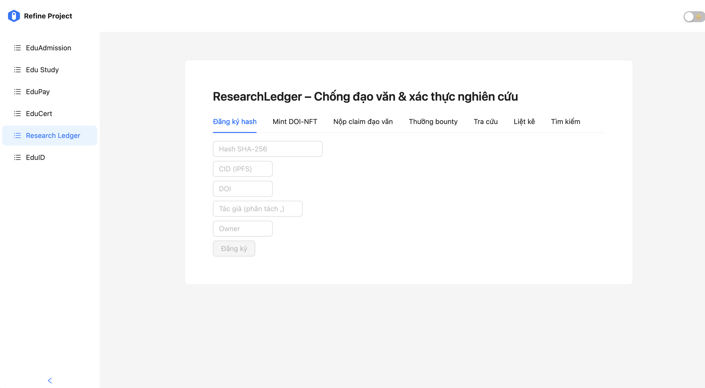
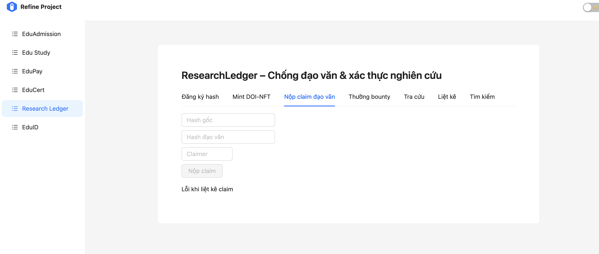
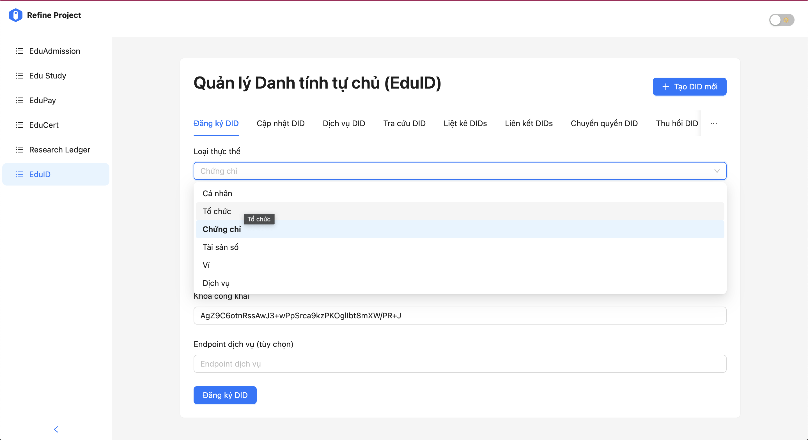
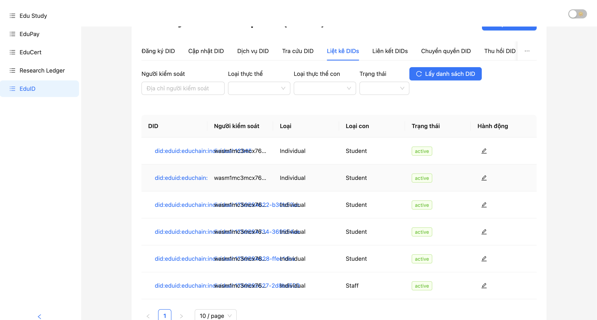

# DNU-FTA-VietEduChain

## TỔNG QUAN

DUN-FTA-VietEduChain là một dự án blockchain layer 1 được xây dựng trên nền tảng Cosmos SDK, như là một giải pháp góp phần đổi mới phương thức quản lý chất lượng đào tạo đại học, giảm thiểu quy trình và thủ tục hành chính liên quan đến việc cấp và xác nhận bằng cấp, chứng chỉ tại Việt Nam. Thông qua các ứng dụng phi tập trung và hợp đồng thông minh, dự án nhằm nâng cao tính minh bạch, bảo mật và hiệu quả trong các hoạt động tuyển sinh, đào tạo và quản lý chất lượng đào tạo, bao gồm cấp bằng và chứng chỉ, quản lý danh tính (các trường đại học, chương trình đào tạo, các cá nhân (cán bộ, giảng viên và sinh viên), bằng và chứng chỉ, v.v...), xử lý thanh toán, đảm bảo tính toàn vẹn và liêm chính trong nghiên cứu khoa học, sự minh bạch và tuân thủ của các trường đại học đối với các quy định của Bộ Giáo dục và Đào tạo Việt Nam như quy chế tuyển sinh và đào tạo, cũng như các quy định về đảm bảo cơ sở vật chất phục vụ quá trình đào tạo.

## MỤC TIÊU VÀ PHẠM VI DỰ ÁN

### Mục tiêu tổng quát

1. Xây dựng DNU-FTA-VietEduChain Layer-1 chuyên biệt cho giáo dục đại học của Việt Nam, đáp ứng đồng thời ba trụ cột: (1) Hiệu năng cấp hạ tầng; (2) thông lượng ≥ 30.000 giao dịch/giây; (3) thời gian hoàn tất ("finality") ≈ 1,2 giây; phí giao dịch < 0,1% giá trị.
2. Chuẩn dữ liệu quốc tế: hỗ trợ đầy đủ Verifiable Credential (VC) và Decentralized Identifier (DID) theo khuyến nghị W3C; sẵn sàng liên thông qua Inter-Blockchain Communication (IBC).
3. Hõ trợ quản lý và giám sát toàn bộ chu trình đào tạo từ tuyển sinh, đăng ký học tập và quá trình đào tạo, nộp học phí, cấp văn bằng chứng chỉ, đến lưu vết hoạt động nghiên cứu khoa học để bảo đảm sự tuân thủ các quy định về đào tạo, minh bạch, an toàn dữ liệu và khả năng mở rộng, phát triển trong dài hạn.

## TÍNH NĂNG

### Backend (BE)

- **Lớp Core**: Xây dựng trên đồng thuận HotStuff, DAG mempool và CosmWasm để đảm bảo khả năng mở rộng và hiệu suất.
- **Module Chức Năng**: Bao gồm EduAdmission, EduPay, EduStudy, EduCert, ReserchLedger and EduID để phục vụ các quy trình khác nhau trong chu trình đào tạo của các trường.
- **API & SDK**: REST/gRPC và GraphQL API, cùng với JS/Flutter SDK để dễ dàng tích hợp.
- **Khả Năng Tương Tác**: IBC relay và khả năng cross-chain để kết nối với các blockchain khác.
- **Công Cụ Giám Sát**: Prometheus và Grafana để minh bạch dữ liệu thời gian thực và theo dõi KPI.
- **Tuân Thủ Pháp Lý**: Tuân thủ các tiêu chuẩn PDPA Việt Nam 2023 và GDPR về bảo vệ dữ liệu.

### Frontend (FE)

- **Giao diện người dùng hiện đại**: Xây dựng trên React và Next.js với thiết kế đáp ứng cho các thiết bị khác nhau.
- **Các module tương tác**: Giao diện người dùng cho tất cả các module blockchain (EduAdmission, EduPay, EduStudy, EduCert, ResearchLedger, EduID).
- **Tích hợp API**: Tương tác với backend thông qua các API RESTful được chuẩn hóa theo Cosmos SDK.
- **Xác thực và phân quyền**: Hỗ trợ đăng nhập, quản lý phiên và phân quyền người dùng.
- **Quản lý trạng thái**: Sử dụng React Context và các provider để quản lý trạng thái ứng dụng.
- **Đa ngôn ngữ**: Hỗ trợ tiếng Việt và tiếng Anh cho tất cả các giao diện.

## SMART CONTRACTS

Dự án bao gồm các hợp đồng thông minh sau:

1. **EduAdmission**: Quản lý quá trình tuyển sinh của các cơ sở đào tạo, giám sát việc thực hiện chỉ tiêu và đảm bảo tiêu chuẩn tuyển sinh.
2. **EduPay**: Quản lý việc đăng ký học tập và thanh toán học phí của sinh viên cho cơ sở đào tạo.
3. **EduStudy**: Quản lý quá trình học tập và rèn luyện của sinh viên, đảm bảo sinh viên hoàn thành chương trình đào tạo, đánh giá kết quả học tập và sự tham gia các hoạt động ngoại khóa của sinh viên trong quá trình đào tạo tại trường đại học.
4. **EduCert**: Quản lý văn bằng tốt nghiệp và chứng chỉ: xử lý việc cấp, xác minh và thu hồi bằng tốt nghiệp cũng như đối với chứng chỉ các khóa đào tạo ngắn hạn.
5. **ResearchLedger**: Ghi chép và xác minh những đóng góp nghiên cứu khoa học và xuất bản của cán bộ, giảng viên và sinh viên, góp phần đảm bảo tính liêm chính trong hoạt động nghiên cứu khoa học và công nghệ.
6. **EduID**: Xác minh danh tính của trường đại học và các chủ thể, văn bằng, chứng chỉ, tài nguyên trí tuệ, v.v... dựa trên hệ thống nhận dạng phi tập trung (DID) hỗ trợ quá trình quản lý, giám sát và tiết kiệm chi phí, thủ tục hành chính liên quan đến xác nhận, đồng thười giảm thiểu sự giả mạo về kết quả đào tạo.

## BẮT ĐẦU

### Yêu cầu hệ thống

- Rust (phiên bản 1.70.0 trở lên)
- Go (phiên bản 1.20 trở lên)
- Docker và Docker Compose
- wasm32-unknown-unknown target cho Rust (`rustup target add wasm32-unknown-unknown`)
- Node.js (phiên bản 18 trở lên) cho Frontend

### Cài đặt môi trường phát triển

1. Clone repository:

```bash
git clone https://github.com/yourusername/viet-educhain.git
cd viet-educhain
```

2. Khởi động node blockchain:

```bash
cd be/educhain/deployments/devnet
./run_wasmd_node.sh
```

3. Build các smart contract:

```bash
cd be/educhain/deployments/scripts
./build_educhain_contracts.sh
```

4. Deploy các smart contract lên blockchain:

```bash
cd be/educhain/deployments/scripts
./deploy_educhain_contracts.sh
```
### Video hướng dẫn
Bạn có thể xem video hướng dẫn trực tiếp dưới đây:

[](https://youtu.be/McM8y8Zghsg)

> Nhấn vào hình để xem video hướng dẫn trên YouTube.

> Nếu xem trên GitHub, có thể iframe

> Nếu xem trên GitHub, có thể iframe sẽ không hiển thị. Vui lòng truy cập trực tiếp: [https://youtu.be/McM8y8Zghsg](https://youtu.be/McM8y8Zghsg)

5. Chạy frontend:

```bash
cd fe
npm install
npm run dev
```
### Video minh hoạ

Bạn có thể xem video minh hoạ dưới đây:

[](https://youtu.be/1jZpKambk9w)

> Nhấn vào hình để xem video minh hoạ trên YouTube.

> Nếu iframe không hiển thị trên GitHub, vui lòng truy cập trực tiếp: [https://youtu.be/1jZpKambk9w](https://youtu.be/1jZpKambk9w)
#### Giải thích các bước cài đặt backend (BE) như trong video

Quy trình cài đặt backend của VietEduChain sử dụng Docker để đảm bảo môi trường nhất quán, dễ triển khai và dễ bảo trì. Dưới đây là giải thích ý nghĩa từng bước chính:

1. **Build Docker image cho backend**
   - Sử dụng lệnh `docker build` để tạo một image chứa đầy đủ môi trường chạy node blockchain (wasmd), các thư viện cần thiết, và các công cụ hỗ trợ như FastAPI, MinIO client.
   - Dockerfile sẽ thực hiện các thao tác như: cài đặt Go, build binary wasmd, cài các thư viện hệ thống, copy file cấu hình, và thiết lập các biến môi trường mặc định.

2. **Chạy container backend**
   - Lệnh `docker run` sẽ khởi tạo một container từ image vừa build, đồng thời map các port cần thiết (26657 cho RPC, 1317 cho REST, 1318 cho FastAPI custom API).
   - Volume dữ liệu được mount để lưu trữ trạng thái blockchain và các file cấu hình, giúp dữ liệu không bị mất khi container dừng.
   - Các biến môi trường như `DAEMON_HOME`, `CHAIN_ID`... giúp tùy biến cấu hình chain khi khởi động.
   - Container sẽ chạy script `enhanced_start_v124 copy.sh` để tự động:
     - Kiểm tra/cài đặt các thư viện cần thiết
     - Khởi tạo chain mới nếu chưa có dữ liệu (tạo validator, genesis, cấu hình gas, CORS, Prometheus...)
     - Khởi động node wasmd và FastAPI custom API
     - Đảm bảo MinIO bucket phục vụ lưu trữ dữ liệu phi tập trung
     - Theo dõi và tự động restart FastAPI nếu bị lỗi

3. **Kiểm tra log node và FastAPI**
   - Có thể xem log node blockchain bằng lệnh `docker logs -f vieteduchain-be`.
   - Có thể kiểm tra log FastAPI bằng lệnh `docker exec -it vieteduchain-be tail -f /var/log/fastapi.log` để theo dõi trạng thái API custom.

4. **Kiểm tra API health**
   - Sử dụng lệnh `curl http://localhost:1318/api/v1/health` để xác nhận FastAPI đã sẵn sàng phục vụ request.

**Ý nghĩa tổng thể:**
- Toàn bộ quy trình giúp bạn triển khai backend blockchain một cách tự động, nhất quán, không phụ thuộc vào môi trường máy chủ vật lý.
- Docker hóa backend giúp dễ dàng nâng cấp, backup, khôi phục và mở rộng hệ thống.
- Script khởi động thông minh giúp phát hiện lỗi, tự động khởi tạo lại các thành phần cần thiết, đảm bảo hệ thống luôn sẵn sàng hoạt động.

> Nếu bạn muốn tùy biến thêm (ví dụ: thay đổi port, thêm contract, cấu hình MinIO...), chỉ cần chỉnh sửa biến môi trường hoặc các file cấu hình trước khi build/run Docker.

### Triển khai lên server

Khi triển khai lên môi trường server, hãy tuân thủ chính xác các bước sau theo thứ tự:

1. Clone code repository:

```bash
git clone https://github.com/yourusername/viet-educhain.git
cd viet-educhain
```

2. Khởi tạo và chạy blockchain node:

```bash
cd be/educhain/deployments/devnet
./run_wasmd_node.sh
```

3. Build tất cả các smart contract:

```bash
cd be/educhain/deployments/scripts
./build_educhain_contracts.sh
```

4. Deploy các smart contract lên blockchain:

```bash
cd be/educhain/deployments/scripts
./deploy_educhain_contracts.sh
```

5. Cập nhật địa chỉ contract trong cấu hình ứng dụng:

```bash
# Địa chỉ contract sẽ được lưu trong các file sau khi deploy
cat be/educhain/deployments/devnet/data/eduadmission_address.txt
cat be/educhain/deployments/devnet/data/edupay_address.txt
cat be/educhain/deployments/devnet/data/edustudy_address.txt
cat be/educhain/deployments/devnet/data/educert_address.txt
cat be/educhain/deployments/devnet/data/researchledger_address.txt
cat be/educhain/deployments/devnet/data/eduid_address.txt


6. Cấu hình và khởi chạy frontend:

```bash
cd fe
npm install
npm run build
npm run start
```

**Lưu ý quan trọng**: Môi trường server sẽ không tự động đồng bộ hóa với môi trường phát triển riêng của bạn (người phát triển hệ thống). Dữ liệu blockchain, trạng thái tài khoản và tương tác hợp đồng từ môi trường phát triển riêng của bạn sẽ không có trên server. Mỗi lần triển khai tạo ra một phiên bản blockchain mới với trạng thái ban đầu.

### Tương tác với Contracts

Sau khi triển khai, bạn có thể tương tác với các hợp đồng thông minh bằng các script được cung cấp:

```bash
cd be/educhain/deployments/scripts
./interact_with_contracts.sh <contract_name> <function_name> <parameters>
```

## THÔNG TIN KÍCH THƯỚC CONTRACT

Kích thước contract đã biên dịch hiện tại:

- **eduadmission**: 2,092,628 bytes
- **eduPay**: 2,052,265 bytes
- **EduStudy**: 2,158,206 bytes
- **eduCert**: 2,158,206 bytes
- **researchledger**: 2,073,345 bytes
- **eduid**: 2,200,672 bytes

## XỬ LÝ SỰ CỐ

Nếu bạn gặp sự cố khi build các smart contract, bạn có thể thử phương pháp build thủ công:

```bash
cd be/educhain/deployments/scripts
./manual_build_contracts.sh
```

Nếu bạn gặp vấn đề với frontend, hãy thử:

```bash
cd fe
npm clean-install
npm run dev
```

## CÁC Ý KIẾN ĐÓNG GÓP HOÀN THIỆN

Chúng tôi hoan nghênh tất cả những ý kiến đóng góp bổ sung và hoàn thiện! Vui lòng gửi pull request hoặc mở issue cho bất kỳ sự hoàn thiện, nâng cấp hoặc sửa lỗi.

## GIẤY PHÉP

Dự án này được cấp phép theo Giấy phép MIT. Xem file LICENSE để biết chi tiết.

## CHI TIẾT CÁC MODULE

### EduAdmission

Module quản lý tuyển sinh theo quy định của Bộ Giáo dục và Đào tạo:
- Đăng ký chỉ tiêu tuyển sinh của cơ sở đào tạo.
- Xác nhận kết quả đăng ký chỉ tiêu tuyển sinh của cơ sở đào tạo. 
- Công bố điểm và kết quả tuyển sinh vào ngành học theo các nguyện vọng đăng ký.
- Xác thực quy trình và kết quả tuyển sinh của cơ sở đào tạo.

### Ảnh minh họa




Ảnh trên minh họa giao diện thêm mới chỉ tiêu tuyển sinh cho một cơ sở đào tạo. Người dùng có thể nhập thông tin về ngành học, số lượng chỉ tiêu, năm tuyển sinh và các tiêu chí liên quan. Giao diện này giúp đảm bảo quy trình đăng ký chỉ tiêu minh bạch, dễ kiểm soát và tuân thủ quy định của Bộ Giáo dục và Đào tạo.

### EduPay

Module thanh toán học phí và học bổng:
- Tạo escrow thanh toán học phí
- Xác nhận đăng ký học
- Xác nhận nộp học phí cho trường
- Quản lý thực hiện chính sách học bổng, khuyến khích học tập
#### Video minh họa EduPay

[](https://youtu.be/iBvNH9J4DqQ)

> Nhấn vào hình để xem video minh họa quy trình thanh toán học phí và học bổng trên YouTube.

#### Script thuyết minh video minh họa

```markdown
[](https://youtu.be/iBvNH9J4DqQ)

Video này trình bày quy trình sử dụng module EduPay để tạo escrow thanh toán học phí, xác nhận đăng ký học và nộp học phí cho trường. Người dùng có thể theo dõi từng bước thực hiện giao dịch, kiểm tra trạng thái thanh toán, xác nhận nhận học bổng hoặc các khoản hỗ trợ tài chính. Ngoài ra, video cũng minh họa cách kiểm tra số dư ví của sinh viên trước khi thực hiện giao dịch và thao tác mint token vào ví để đảm bảo đủ số dư cho việc thanh toán. Giao diện trực quan giúp sinh viên và nhà trường dễ dàng quản lý các khoản thu chi, đảm bảo minh bạch và an toàn trong quá trình thanh toán.
```

### EduStudy

Module quản lý quá trình học tập và rèn luyện của sinh viên:
- Đánh giá quá trình học tập và kết quả học tập của sinh viên
- Đánh giá sự hoàn thành chương trình đào tạo theo ngành và chuyên ngành
- Đáng giá kết quả rèn luyện và tham gia các hoạt động ngoại khóa của sinh viên
#### Ảnh minh họa EduStudy



Ảnh trên minh họa giao diện quản lý quá trình học tập của sinh viên, bao gồm thông tin về các môn học đã đăng ký, điểm số, trạng thái hoàn thành và các hoạt động ngoại khóa. Giao diện này giúp nhà trường và sinh viên theo dõi tiến độ học tập, đánh giá kết quả và đảm bảo sinh viên đáp ứng các yêu cầu tốt nghiệp.

#### Script thuyết minh ảnh minh họa

```markdown


Giao diện EduStudy cho phép theo dõi chi tiết tiến trình học tập của từng sinh viên. Người dùng có thể xem danh sách môn học, điểm số từng học phần, trạng thái hoàn thành và các hoạt động ngoại khóa đã tham gia. Tính năng này hỗ trợ nhà trường trong việc đánh giá kết quả học tập, đồng thời giúp sinh viên chủ động kiểm soát lộ trình đào tạo của mình.
```
### EduCert

Module quản lý văn bằng điện tử, hỗ trợ:
- Cấp văn bằng mới
- Xác minh tính chính xác của văn bằng
- Chia sẻ văn bằng với bên thứ ba
- Kiểm tra lịch sử thay đổi
#### Ảnh minh họa EduCert




#### Script thuyết minh ảnh minh họa

```markdown


Hai ảnh trên minh họa các chức năng chính của module EduCert. Ảnh đầu tiên thể hiện giao diện cấp văn bằng điện tử mới, nơi cán bộ quản lý nhập thông tin sinh viên, loại văn bằng, ngày cấp và các thông tin liên quan. Ảnh thứ hai là giao diện danh sách các văn bằng đã được cấp, cho phép tra cứu, xác minh, chia sẻ hoặc kiểm tra lịch sử thay đổi của từng văn bằng. Giao diện trực quan giúp đảm bảo quy trình cấp phát và xác thực văn bằng minh bạch, chính xác và dễ dàng kiểm soát.
```
### ResearchLedger

Module quản lý nghiên cứu khoa học:
- Đăng ký nghiên cứu mới
- Lưu trữ hash của tài liệu nghiên cứu
- Kiểm tra trùng lặp và đạo văn
- Quản lý quyền sở hữu trí tuệ
#### Ảnh minh họa ResearchLedger




#### Script thuyết minh ảnh minh họa

```markdown


Hai ảnh trên minh họa các chức năng chính của module ResearchLedger. Ảnh đầu tiên thể hiện giao diện đăng ký nghiên cứu mới, nơi người dùng nhập thông tin đề tài, tác giả, mô tả và tải lên tài liệu liên quan. Ảnh thứ hai là danh sách các nghiên cứu đã đăng ký, hiển thị trạng thái xác minh, hash tài liệu và các thao tác kiểm tra trùng lặp, xác thực quyền sở hữu trí tuệ. Giao diện trực quan giúp nhà trường và giảng viên dễ dàng quản lý, xác minh và bảo vệ quyền lợi nghiên cứu khoa học.
```
### EduID

Module quản lý danh tính dựa trên DID (Decentralized Identifiers), cho phép:
- Tạo danh tính số mới
- Truy vấn thông tin danh tính
- Cập nhật thông tin danh tính
- Xác thực danh tính

#### Ảnh minh họa thêm mới EduID



#### Ảnh minh họa danh sách EduID



Ảnh trên minh họa giao diện danh sách các danh tính số (EduID) đã được tạo trên hệ thống. Mỗi mục trong danh sách thể hiện thông tin cơ bản của một EduID như mã định danh, tên chủ sở hữu, trạng thái xác thực và các thao tác quản lý (xem chi tiết, chỉnh sửa, xác thực hoặc thu hồi). Giao diện này giúp quản trị viên hoặc người dùng dễ dàng tra cứu, kiểm tra và quản lý các danh tính số trong môi trường giáo dục đại học, đảm bảo tính minh bạch và an toàn dữ liệu cá nhân.

## hạn chế trong Layer 1 của VietEduChain

### 1. Hạn chế về môi trường triển khai
- Hiện tại hệ thống chủ yếu được triển khai và kiểm thử trong môi trường phát triển cục bộ (local development environment), chưa được đưa lên các nền tảng hạ tầng thực tế như public cloud hay production-grade server. Làm giảm hiệu quả trong việc thực hiện các bài kiểm thử tích hợp (integration testing) ở quy mô thực tế, cũng như hạn chế khả năng đánh giá toàn diện về hiệu năng (performance benchmarking) và khả năng mở rộng (scalability assessment) của hệ thống dưới tải thực.


+ Đơn giản hơn thì hệ thống hiện vẫn chỉ được chạy thử nghiệm trên máy tính cá nhân của nhóm phát triển (local environment) chứ chưa được đưa lên môi trường thật (như internet hay server thật). Điều này khiến cho việc kiểm tra độ ổn định, tốc độ xử lý khi có nhiều người dùng truy cập cùng lúc, hay việc lấy ý kiến từ người dùng bên ngoài trở nên khó khăn.


- Do chưa có một môi trường triển khai công khai (internet-accessible environment), các bên liên quan (stakeholders) hiện vẫn chưa thể truy cập hệ thống để tương tác hoặc trải nghiệm trực tiếp. Điều này dẫn đến việc thu thập phản hồi từ người dùng thực (real-world feedback) còn hạn chế, gây khó khăn trong việc đánh giá mức độ ổn định (system stability) khi chạy trên hạ tầng mạng công cộng, đặc biệt là trong các kịch bản vận hành dài hạn. Để đảm bảo các yêu cầu về tính sẵn sàng (availability), độ tin cậy (reliability) và khả năng mở rộng theo chiều ngang (horizontal scalability), việc chuyển đổi hệ thống sang môi trường staging hoặc production sẽ được triển khai sớm.


+ Giải pháp sắp tới là sẽ đưa hệ thống lên môi trường "online" thử nghiệm để kiểm tra và điều chỉnh tốt hơn.

### 2. Hạn chế về giao diện người dùng (GUI) và tích hợp với hệ thống lõi (core system)
- **Phần giao diện người dùng (Graphical User Interface - GUI)** hiện vẫn đang trong giai đoạn phát triển và chưa đạt mức độ hoàn thiện cần thiết để tích hợp một cách ổn định với các thành phần lõi (core modules) của hệ thống. Điều này ảnh hưởng đáng kể đến trải nghiệm người dùng (user experience - UX), cũng như khả năng thực hiện các luồng tương tác liền mạch (seamless interaction flows) giữa frontend và business logic ở tầng backend.


- **Việc GUI chưa được tích hợp đầy đủ với core** dẫn đến nguy cơ xảy ra các vấn đề về đồng bộ dữ liệu (data synchronization issues), quản lý trạng thái phức tạp (state management inconsistencies), và khó khăn trong việc thực hiện kiểm thử đầu-cuối (end-to-end testing). Ngoài ra, thiếu một kiến trúc tích hợp rõ ràng giữa frontend và backend cũng có thể ảnh hưởng đến maintainability và tốc độ phát triển tính năng mới trong tương lai.


+ Giao diện người dùng – phần người dùng trực tiếp thao tác – hiện vẫn chưa được hoàn thiện và chưa "ăn khớp" với các phần chức năng lõi bên trong hệ thống. Khi sử dụng có thể khiến thao tác gặp khó chịu, không mượt, hoặc dữ liệu xử lý chưa chính xác.


- Để cải thiện độ ổn định (stability), tính nhất quán (consistency), cũng như đảm bảo khả năng mở rộng hệ thống về mặt kiến trúc, cần sớm hoàn thiện GUI và chuẩn hóa quy trình tích hợp với core theo các nguyên tắc của kiến trúc hướng dịch vụ (SOA – Service-Oriented Architecture) hoặc kiến trúc hướng thành phần (modular architecture), kết hợp với CI/CD pipeline để hỗ trợ việc triển khai và kiểm thử tự động.


+ **Mục tiêu sắp tới** là hoàn thiện phần giao diện và kết nối chặt chẽ với phần lõi để mọi thứ chạy trơn tru, ổn định hơn. 
Lý do khách quan đang hạn chế về mặt thời gian nên phần tóm tắt cũng đưa ra các mặt hạn chế của hệ thống nhằm đảm bảo sự rõ ràng về hệ thống hơn. Xong cũng đưa ra các điểm yếu cần khắc phục thêm trong thời gian sắp tới.

